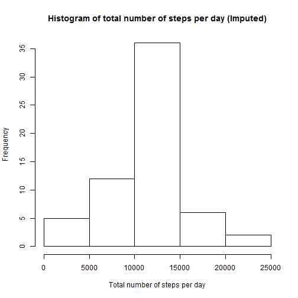

====================================================================

## Loading and preprocessing the data


```r
# Load lattice package required for the last plot.
library(lattice)
```


Show any code that is needed to:  
    
1. Load the data (i.e. read.csv())  
2. Process/transform the data (if necessary) into a format suitable for your analysis 
        


```r
# Load the data file into a data frame
activity<-read.csv(file = "activity.csv", colClasses= c("integer","Date","integer"))
```

## What is mean total number of steps taken per day?  

For this part of the assignment, you can ignore the missing values in the dataset.  

1. Calculate the total number of steps taken per day  
        

```r
# Calculate the total number of steps taken per day
totalStepsPerDay<-tapply(activity$steps, activity$date,sum)
```
        
2. If you do not understand the difference between a histogram and a barplot, research the difference between them. Make a histogram of the total number of steps taken each day  
        

```r
# Make a histogram of the total number of steps taken each day
hist(totalStepsPerDay,  main="Histogram of total number of steps per day", xlab = "Total number of steps per day")
```

 
        
        
3. Calculate and report the mean and the median of the total number of steps taken per day  
        

```r
# Calculate and report the mean and median of the total number of steps taken per day
meanValue<-round(mean(totalStepsPerDay,na.rm = TRUE))
meanValue
```

```
## [1] 10766
```

**The mean number of steps taken per day is 1.0766 &times; 10<sup>4</sup>.**


```r
# Calculate and report the mean and median of the total number of steps taken per day
medianValue<-median(totalStepsPerDay,na.rm = TRUE)
medianValue
```

```
## [1] 10765
```


**The median number of steps taken per day is 10765.**

## What is the average daily activity pattern?

1. Make a time series plot (i.e. type = "l") of the 5-minute interval (x-axis) and the average number of steps taken, averaged across all days (y-axis)  
        

```r
# Process the data to make the plot
meanStepsPerInterval <- aggregate(steps ~ interval, activity, mean, na.rm = TRUE)

# Create a time series plot.
plot(steps ~ interval, data = meanStepsPerInterval, type="l", xlab = "Interval", ylab ="Average number of steps" )
```

 

2. Which 5-minute interval, on average across all the days in the dataset, contains the maximum number of steps?  
        

```r
# Find the index of the maximum number of steps
index<-which.max(meanStepsPerInterval$steps)

# Find the interval using the index above.
maxInterval<-meanStepsPerInterval$interval[index]
maxInterval
```

```
## [1] 835
```

**The 5-minute interval that contains the maximum number of steps is 835.**

## Imputing missing values  

Note that there are a number of days/intervals where there are missing values (coded as NA). The presence of missing days may introduce bias into some calculations or summaries of the data.

1. Calculate and report the total number of missing values in the dataset (i.e. the total number of rows with NAs)  
        

```r
sumNA<-sum(is.na(activity$steps))
sumNA
```

```
## [1] 2304
```
        
**The total number of rows with missing values (NA) is 2304.**

2. Devise a strategy for filling in all of the missing values in the dataset. The strategy does not need to be sophisticated. For example, you could use the mean/median for that day, or the mean for that 5-minute interval, etc.  

**The strategy I will used was to fill the missing values with the mean for that 5-minute interval.**


3. Create a new dataset that is equal to the original dataset but with the missing data filled in.  
        

```r
activityImputed<-activity
for (i in 1:nrow(activityImputed))
{
        if (is.na(activityImputed$steps[i]))
        {
                interval<-activityImputed$interval[i]
                rowIdx <- which(meanStepsPerInterval$interval == interval)
                activityImputed$steps[i]<-meanStepsPerInterval$steps[rowIdx]
        }
}
```

4. Make a histogram of the total number of steps taken each day.  
        
        

```r
# Calculate the total number of steps taken per day
totalStepsPerDayImputed<-tapply(activityImputed$steps, activityImputed$date,sum)

# Create histogram of the total number of steps taken each day
hist(totalStepsPerDayImputed,  main="Histogram of total number of steps per day (Imputed)", xlab = "Total number of steps per day")
```

 


4. Calculate and report the mean and median total number of steps taken per day. Do these values differ from the estimates from the first part of the assignment? What is the impact of imputing missing data on the estimates of the total daily number of steps?  
        
        

```r
# Calculate and report the mean of the total number of steps taken per day
meanValue<-round(mean(totalStepsPerDayImputed))
meanValue
```

```
## [1] 10766
```

**The mean number of steps taken per day is 1.0766 &times; 10<sup>4</sup>. **


```r
# Calculate and report the median of the total number of steps taken per day
medianValue<-median(totalStepsPerDayImputed)
medianValue
```

```
## [1] 10766.19
```

**The median number of steps taken per day is 1.0766189 &times; 10<sup>4</sup>. **

**The impact was minimal, the mean value is the same and median value has a slight difference. **

## Are there differences in activity patterns between weekdays and weekends?

For this part the weekdays() function may be of some help here. Use the dataset with the filled-in missing values for this part.

1. Create a new factor variable in the dataset with two levels - "weekday" and "weekend" indicating whether a given date is a weekday or weekend day.


```r
wkdays<-c("Monday", "Tuesday", "Wednesday", "Thursday", "Friday")
# Create a new factor variable called Wday.
activityImputed$Wday<-factor(weekdays(activityImputed$date) %in% wkdays, 
                             levels = c(TRUE, FALSE), labels = c("weekday", "weekend"))
```


2. Make a panel plot containing a time series plot (i.e. type = "l") of the 5-minute interval (x-axis) and the average number of steps taken, averaged across all weekday days or weekend days (y-axis). See the README file in the GitHub repository to see an example of what this plot should look like using simulated data.  
        

```r
# Calculate the average steps by interval across all weekday days or weekend days.
meanStepsPerIntervalImputed <- aggregate(steps ~ interval * Wday, activityImputed, mean)

# Create a panel plot
xyplot(steps ~ interval | Wday, data = meanStepsPerIntervalImputed, type = "l", layout = c(1, 2),xlab = "Inteval", ylab ="Average number of steps")
```

 


